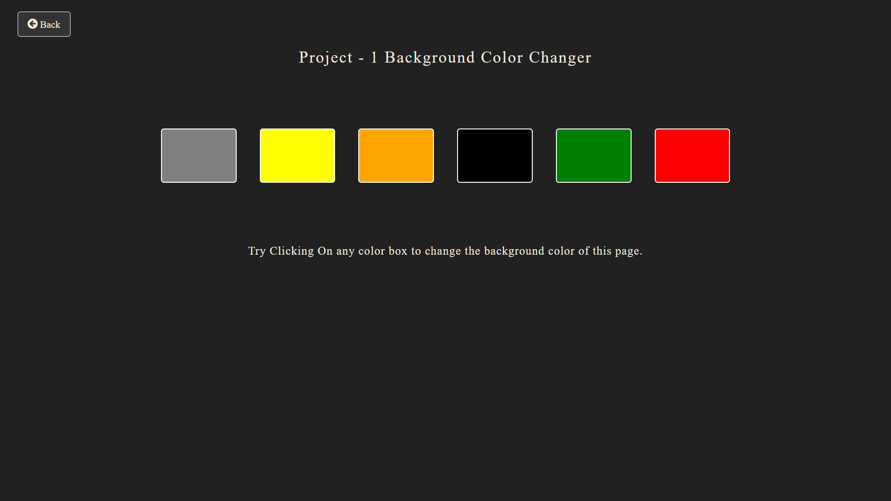
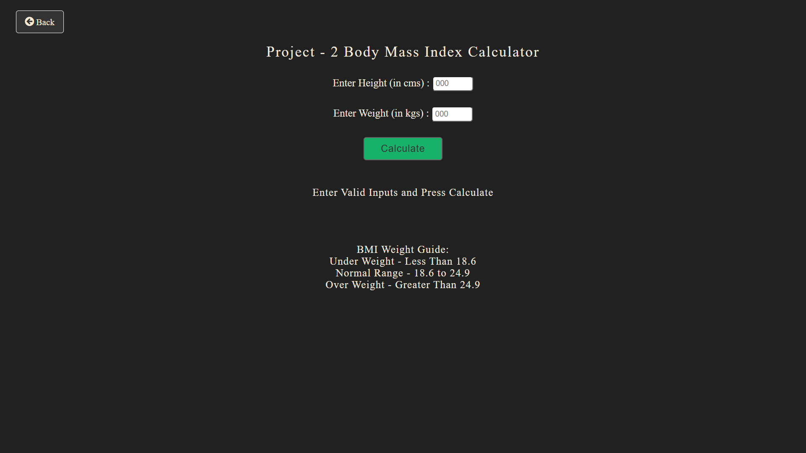
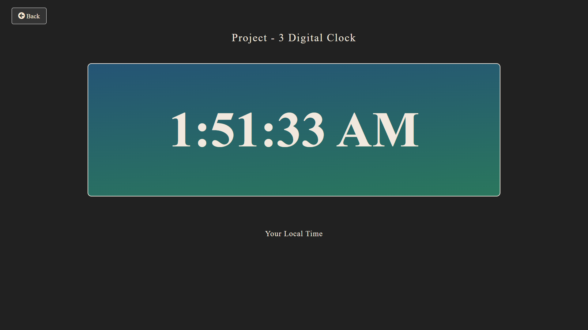
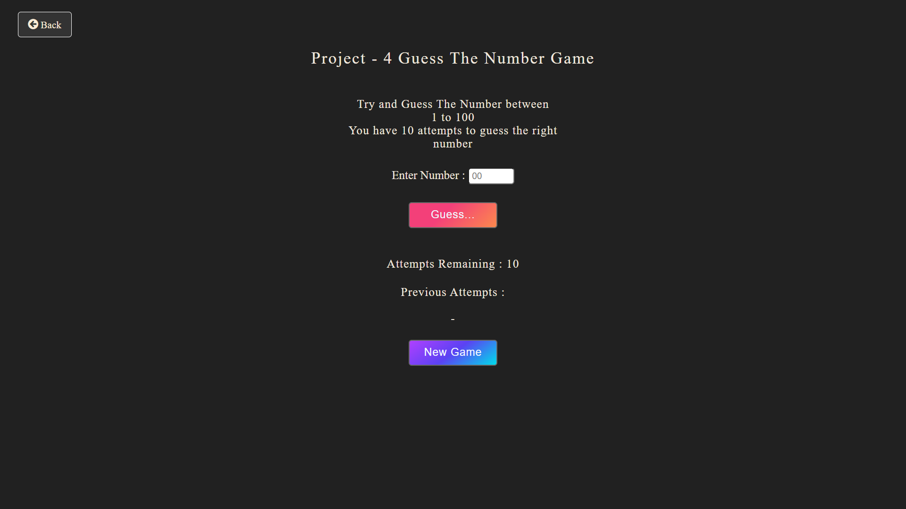

# Minor Projects on JS

Here are some JavaScript practice projects to help gain hands-on experience with the language.

We will be continuously updating this repository by adding new JavaScript-based projects.

### How to Run
- Download all files, download the ZIP, or clone this repository to your desktop.
- Run the project by starting a Live Server in VS Code or opening the index.html file in a browser.

---

## Project - 1

- The first project is a Background Color Changer.
- It allows users to change the background color by selecting from multiple options available on the screen.
- Below is an image of the site, showing how it looks after opening the project.

---

## Project - 2

- The second project is a Body Mass Index (BMI) Calculator.
- It allows users to calculate their BMI by entering essential inputs like height and weight.
- Below is an image of the site, showing how it looks after opening the project.

---

## Project - 3

- The third project is a Digital Clock.
- It displays a large-sized digital clock on the screen, showing the current local time.
- Below is an image of the site, demonstrating how it looks after opening the project.

---

## Project - 4

- The fourth project is a Guess the Number game.
- In this game, players have to guess a number between 1 and 100 within 10 attempts.
- Below is an image of the site showing how it looks after opening the project.

---

# Summary

All these projects are fully responsive, and my main goal in implementing them was to practice JavaScript's DOM manipulation while gaining confidence in the language. Throughout these projects, I explored various DOM manipulation methods to deepen my understanding.

Additionally, working on these projects improved my skills in building responsive websites, reinforcing my ability to create user-friendly and adaptable designs.